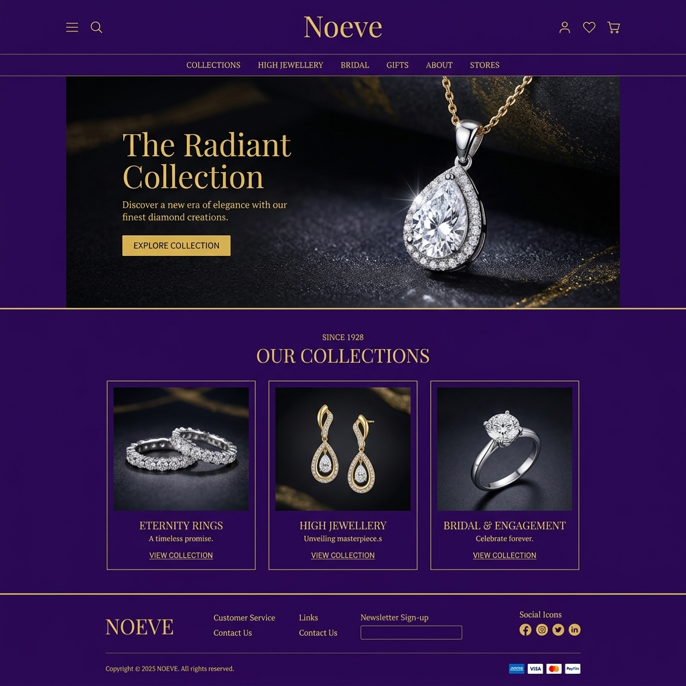
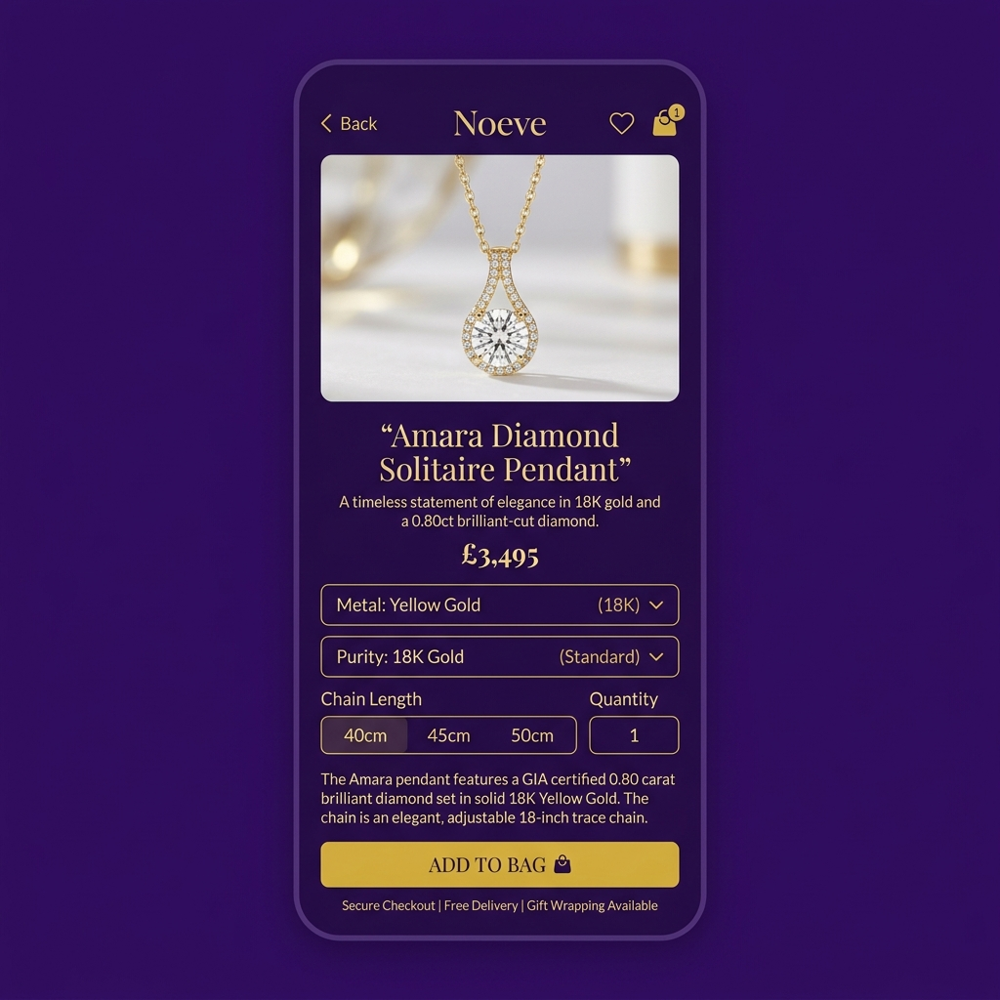
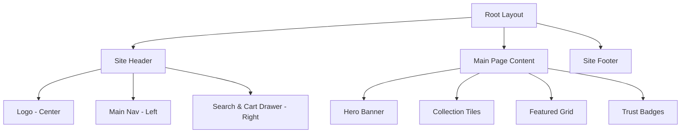

# Noeve — Customer Storefront UI/UX Design Layout Specification

This document details the visual style, design patterns, layout templates, and component trees for both **Noeve Webstore** (Next.js 15) and **Noeve Mobile Store** (Expo React Native). It translates the architecture definitions in `docs/ARCHITECTURE.md` and design tokens in `@noeve/ui-tokens` into concrete UI layouts.

---

## 1. Visual Identity & Design System

### 1.1 Brand Color Palette
Noeve uses a sophisticated **Deep Rich Purple & Metallic Gold** theme that reflects prestige, fine craftsmanship, and luxury.

*   **Primary Theme (Purple):**
    *   `primary`: `#4A148C` (Deep Imperial Purple - represents luxury, authority, and depth)
    *   `primaryDark`: `#311B92` (Deep Obsidian Indigo - used for dark backgrounds, footer elements, and high-contrast dark states)
    *   `accentLight`: `#F3E8FF` (Lavender mist - used for hover effects, badge backgrounds, and secondary focus areas)
*   **Accent Palette (Gold):**
    *   `accent`: `#D4AF37` (Metallic Gold - used for CTAs, gold purity tags, primary borders, and highlights)
    *   `accentGold`: `#F5E6B8` (Soft Champagne Gold - used for backgrounds, card containers, and delicate details)
*   **Neutral Palette:**
    *   `neutral-50`: `#FAFABA` (Off-white - main page background)
    *   `neutral-100`: `#F5F5F5` (Cool grey - borders, dividers)
    *   `neutral-900`: `#171717` (Charcoal - main text color for high legibility)

### 1.2 Typography & Fonts
*   **Headings & Accent Titles:** `Cormorant Garamond` (Elegant Serif font, Georgia fallback). Specifically for H1, H2, and collection titles.
*   **Body & Utility Text:** `Inter` (Clean Sans-Serif font, system-ui fallback). Used for descriptions, inputs, buttons, prices, and settings.

### 1.3 Micro-Animations & Interactions
1.  **Gold Glow Border:** Hovering on category or product cards triggers a subtle outer shadow glow using `--brand-accent` (Gold).
2.  **CTA Shimmer:** The "Add to Bag" button features a periodic, subtle metallic sheen animation moving left-to-right.
3.  **Active Underline:** Navigation items have a bottom underline that slides out from the center on hover.

---

## 2. High-Fidelity Design Mockups

Here are the visual representations of the Noeve user interface:

### 2.1 Web Store Home Page Mockup
Displays the luxury storefront landing page layout, showcasing the Hero Banner, Collection grid, and footer.


### 2.2 Mobile Store Product Details Mockup
Displays the product page on a mobile application, showcasing variant selection, descriptions, and the checkout action drawer.


---

## 3. Web Store Layouts (`apps/web-store`)

The Web Store is optimized for desktop conversion, SEO, and fast load times. It is structured around a central 12-column grid container with a maximum width of `1280px` (`max-w-7xl`).

### 3.1 Global Web Page Layout



### 3.2 Key Web Pages Structure

#### A. Home Page Layout (`src/app/page.tsx`)
*   **Hero Banner:**
    *   Full-width (bounded by grid container) featuring a split layout.
    *   *Left (45%):* Heavy typography (Cormorant Garamond), golden sub-header, description, and gold filled CTA.
    *   *Right (55%):* High-resolution close-up product image with a dark purple radial gradient background blending into the edges.
*   **Shop By Collection Grid:**
    *   3-column layout. High-quality collection imagery with a semi-opaque purple-to-gold hover border overlay.
*   **Featured Pieces:**
    *   4-column responsive product list. Clean white background cards, metadata on hover, gold accents for pricing.
*   **Trust Badges:**
    *   Horizontal bar with 4 features (Free Secure Shipping, Insured Delivery, Lifetime Warranty, Certified Authenticity).

#### B. Product Detail Page Layout (`src/app/shop/products/[slug]/page.tsx`)

```
┌────────────────────────────────────────────────────────────────────────┐
│                               Site Header                              │
├────────────────────────────────────────────────────────────────────────┤
│  ◀ Back to Shop                                                        │
│                                                                        │
│  ┌───────────────────────────────┐  ┌────────────────────────────────┐ │
│  │                               │  │ Category / Tag                 │ │
│  │                               │  │ H1: Amara Solitaire Diamond    │ │
│  │                               │  │ ★★★★☆ (12 Reviews)             │ │
│  │                               │  ├────────────────────────────────┤ │
│  │                               │  │ Price: $3,495.00               │ │
│  │         Main Gallery          │  ├────────────────────────────────┤ │
│  │         (Large Zoom)          │  │ Metal:                         │ │
│  │                               │  │ [Yellow Gold] [White] [Rose]   │ │
│  │                               │  │ Purity:                        │ │
│  │                               │  │ [18K] [22K]                    │ │
│  │                               │  ├────────────────────────────────┤ │
│  │                               │  │ [ ADD TO BAG ]                 │ │
│  │                               │  │ [ ADD TO WISHLIST ]            │ │
│  ├───────────────────────────────┤  ├────────────────────────────────┤ │
│  │ [Thumb 1] [Thumb 2] [Thumb 3] │  │ Care & Cleaning (Accordion)    │ │
│  │                               │  │ Shipping & Return Details      │ │
│  └───────────────────────────────┘  └────────────────────────────────┘ │
└────────────────────────────────────────────────────────────────────────┘
```

*   **Left Column (Gallery - 7 Columns):** Sticky scroll container. Large main image with a pinch-to-zoom interactive modal. Inline horizontal carousel of thumbnail images at the bottom.
*   **Right Column (Info & Selectors - 5 Columns):**
    *   *Product Header:* Category tag, H1 Title in Cormorant Garamond, star rating.
    *   *Price Indicator:* Displayed in bold gold typography.
    *   *Configurators:* Metal chips (Yellow Gold, Rose Gold, White Gold) and purity selectors (18K, 22K) dynamically update price hooks.
    *   *CTAs:* Shimmering gold "Add to Bag" button (takes full width of right column) and a secondary bordered button for wishlist.
    *   *Details Accordion:* Collapsible panels for Description, Gemstone specifications, Care manual, and Certification validation.

---

## 4. Mobile Store Layouts (`apps/mobile-store`)

The mobile application (Expo React Native) focuses on touch targets, thumb-friendly navigation, and smooth sheet transitions.

### 4.1 Navigation Hierarchy & Tab bar

```
┌─────────────────────────────────────────────────────────┐
│  (Stack Navigator)                                      │
│   ├── Login / OTP Modal                                 │
│   ├── Product Details [id] (Slide-in)                   │
│   ├── Checkout Screen (Full-screen Overlay)             │
│   └── Tab Navigator (Bottom Nav)                        │
│        ├── Home Tab [Featured, Banners, Search]         │
│        ├── Shop Tab [Category Accordion / List]         │
│        ├── Cart Tab [List, Total, Voucher, Checkout]    │
│        └── Account Tab [Orders, Track, Address]         │
└─────────────────────────────────────────────────────────┘
```

### 4.2 Key Mobile Screen Layouts

#### A. Home Screen (`app/(tabs)/index.tsx`)
*   **Header Bar:** Logo in serif typography centered, shopping cart badge on the right, user profile link on the left.
*   **Interactive Search Box:** Sticky search bar with a soft gold border.
*   **Horizontal Collections Carousel:** Swipeable cards for high-level categories (Fine Jewelry, Pendants, Accessories).
*   **Vertical Product Scroll:** Staggered double-column grid with lightweight cards, displaying price tags highlighted in gold.

#### B. Product Detail Screen (`app/product/[id].tsx`)
*   **Floating Header:** Transparent navigation bar with "Back" and "Wishlist (Heart)" buttons that transition to a solid purple fill upon scrolling down.
*   **Full Screen Carousel:** Swipeable square image container with dot indicators at the bottom.
*   **Customization Drawer (Bottom Sheet):** Pull-up drawer that reveals variant selectors for metal types, chain lengths (40cm, 45cm, 50cm), and purity.
*   **Sticky Footer Action Bar:** Floating bottom sheet containing a primary gold "ADD TO BAG" button that stays fixed regardless of scroll position.

#### C. Cart Screen (`app/(tabs)/cart.tsx`)
*   **Item Cards:** Swipe-to-remove interactions. Left-swipe reveals a trash bin icon with haptic feedback.
*   **Subtotal & Checkout Drawer:** Bottom-aligned summary card displaying subtotal, taxes, and shipping fees. Contains a purple and gold action button to launch the Checkout Stack.

---

## 5. UI Tokens Mapping Reference

This table maps design tokens from `packages/ui-tokens` into Tailwind classes (Web) and React Native StyleSheet variables (Mobile):

| Token | CSS Variable (Web) | Tailwind Class | React Native Style |
| :--- | :--- | :--- | :--- |
| `colors.brand.primary` | `--brand-primary` | `bg-brand-primary` | `color: '#4A148C'` |
| `colors.brand.accent` | `--brand-accent` | `text-brand-accent`, `bg-brand-accent` | `color: '#D4AF37'` |
| `typography.fontFamily.serif`| `--font-cormorant` | `font-serif` | Not applicable (Custom Serif Font loaded) |
| `typography.fontSize.xl` | `24px` | `text-2xl` | `fontSize: 24` |
| `spacing.md` | `16px` | `p-4` or `m-4` | `padding: 16` |
