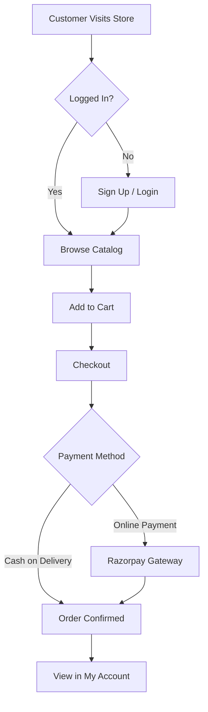
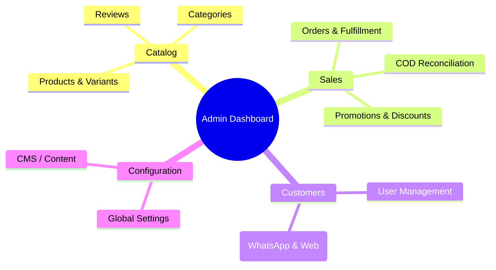

# Noeve Store - Comprehensive User Manual

Welcome to the Noeve Store! This manual provides comprehensive instructions on how to use the various platforms within the Noeve ecosystem, tailored for both Customers and Administrators.

## Table of Contents
1. [For Customers (Web & Mobile Store)](#1-for-customers-web--mobile-store)
2. [For Administrators (Web Admin Dashboard)](#2-for-administrators-web-admin-dashboard)
3. [Support and Troubleshooting](#3-support-and-troubleshooting)

---

## 1. For Customers (Web & Mobile Store)

The Customer Store is available via our Web Portal and Native Mobile Application (iOS & Android). Both platforms offer a synchronized and seamless experience.

### 1.1 Account & Order Workflow

### 1.2 Browsing and Searching for Products
- **Categories:** Use the main navigation menu to browse categories such as Jewellery, Care Products, Accessories, etc.
- **Product Details:** Click on any product to view high-resolution images, detailed descriptions, pricing, available variants (e.g., size, material), and care instructions.

### 1.3 Shopping Cart & Checkout
1. **Add to Cart:** Select your preferred variant (if applicable) and click "Add to Cart". 
2. **Review Cart:** Click the Cart icon to view your selected items, update quantities, or remove products. Free shipping is automatically applied if your order meets the configured threshold.
3. **Checkout:** Proceed to checkout, select or add a new shipping address.
4. **Payment:** Choose your preferred payment method. You can pay securely online via Razorpay or choose Cash on Delivery (if enabled by the store).
5. **Order Confirmation:** Upon successful payment or COD selection, you will receive an order confirmation and can download a PDF invoice from your account.

### 1.4 Managing Orders & Support
- **Order History:** Visit the "Account" > "Orders" section to view your past and current orders.
- **Change to COD:** If an online payment fails, you can easily change the order to Cash on Delivery from your order history (if COD is enabled).
- **Need Help?:** You can open a support ticket directly from any order in your account to communicate with the store's customer service team.

---

## 2. For Administrators (Web Admin Dashboard)

The Web Admin Dashboard is restricted to authorized personnel and is used to manage the store's backend operations.

### 2.1 Admin Architecture & Navigation

### 2.2 Managing the Catalog (Products & Categories)
- **View Products:** Navigate to the "Products" tab to see a list of all items.
- **Add New Product:** Click "Create Product". Fill in the required fields including Name, Description, Price, Stock Quantity, Category, and upload product images. You can manage multiple variants for a single product.
- **Categories:** Create and manage categories, set category-specific tax rates, and define return policies.

### 2.3 Managing Orders & Fulfillment
- **Order Queue:** The "Orders" tab displays all customer orders in real-time. Use the search bar to filter by order number or customer email.
- **Order Details:** Click on an order to view the purchased items, customer details, and payment status.
- **Fulfillment Workflow:** 
  1. Print invoices or packing slips.
  2. Update status from *Confirmed* to *Processing*.
  3. Once shipped, update status to *Shipped* and enter the Tracking Number and Carrier. This allows customers to track their shipment directly from their account.

### 2.4 COD Reconciliation
- **Reconciliation Dashboard:** Under the "Sales" menu, navigate to "Reconciliation".
- **Upload Settlements:** Upload CSV settlement reports provided by your delivery partners (e.g., Delhivery, BlueDart, Porter). The system will automatically map the Order IDs, verify the settled amounts, and update the COD order statuses to `SUCCESS` (Settled).
- **Discrepancy Tracking:** Any short payments or mismatched amounts will be flagged for manual review, allowing your accounting team to track missing funds.

### 2.5 Customer Relationship Management (CRM) & Omnichannel Inbox
- **Support Inbox:** Navigate to the "Inbox" to view all support tickets created by customers. You can reply directly to their queries, and they will receive the updates in their store account.
- **WhatsApp Integration:** The Inbox is fully integrated with WhatsApp. Messages sent by customers to your official WhatsApp Business number will appear as tickets here. Replies from the dashboard will be sent directly back to the customer's WhatsApp.
- **Customer Insights:** View registered customer profiles, their total lifetime value (revenue), and order histories.

### 2.6 Promotions and Marketing
- **Promotions:** Create active discount codes (e.g., `SUMMER20`) that offer percentage-based or flat-rate discounts. Set minimum order values and expiration dates.
- **Content/CMS:** Manage the store's blog posts, mission statements, and other dynamic content directly from the dashboard.

### 2.7 Global Settings Configuration
The "Settings" panel allows administrators to configure store-wide parameters dynamically:
- **General Settings:** Update the Store Name, Contact Email, Support Phone, and WhatsApp numbers. These instantly reflect in the storefront's footer and PDF invoices.
- **Social Media:** Configure links to Facebook, Instagram, etc.
- **Payment & Shipping:** 
  - Toggle **Cash on Delivery (COD)** on or off globally.
  - Set default Shipping Rates and the Free Shipping Threshold.
  - Configure the global Tax Rate.
- **Announcement Banner:** Update the scrolling marquee text at the top of the storefront.

---

## 3. Support and Troubleshooting

### 3.1 Common Issues
- **Forgot Password:** Use the "Forgot Password" link on the login screen to receive a secure reset link via email.
- **Payment Failures:** Ensure your card details are correct. If the issue persists, change your order to COD from your account dashboard.

### 3.2 Contacting Support
If you encounter any persistent issues or require further assistance, please refer to the contact details at the bottom of the store website.
